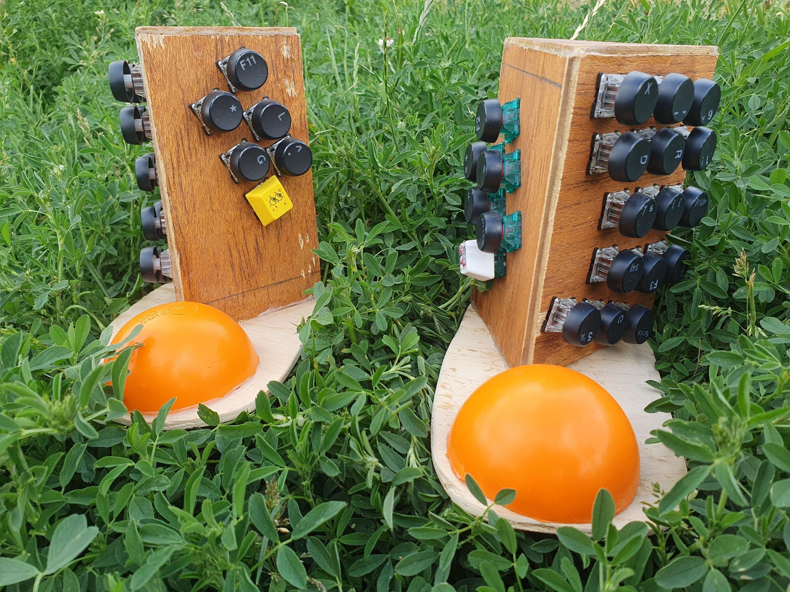
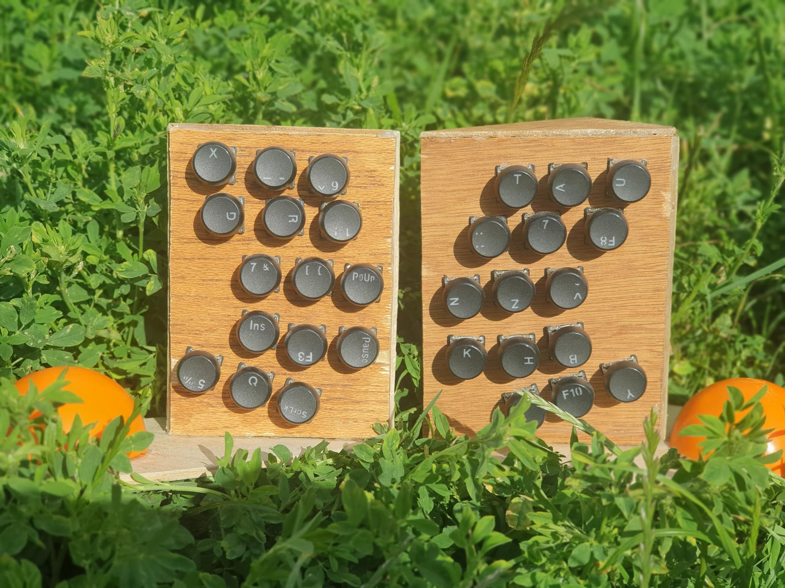
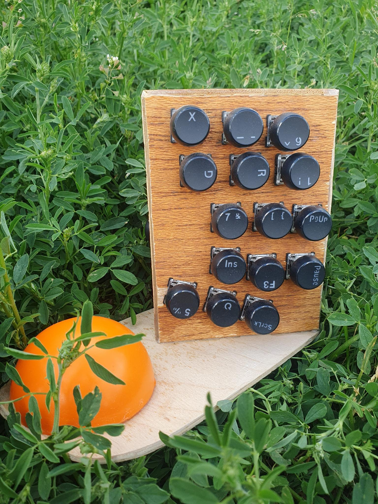
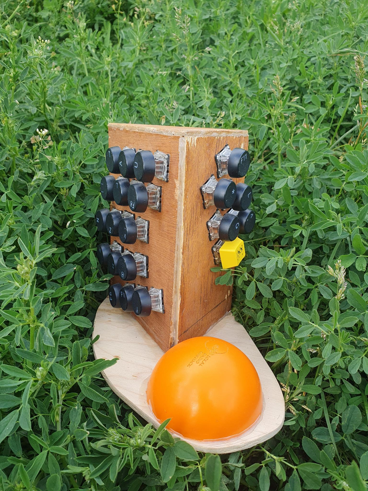
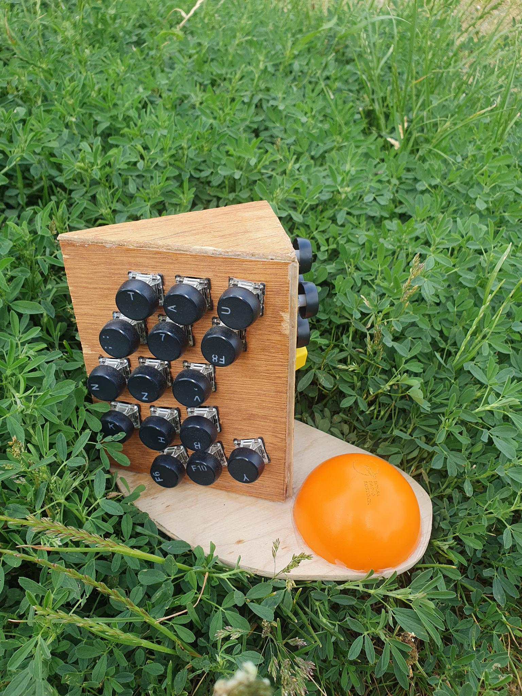

# adipoli ✋🏾⌨️ ⌨️🤚🏾
a handwired split keyboard


<p align="center">
  
  
</p>

Firmware for **adipoli**, a custom hard-wired split keyboard, built on [QMK](https://github.com/qmk/qmk_firmware).

Each half has its own Pro Micro (ATmega32u4) and is flashed separately with the `left` or `right` keymap. There is no serial/USB split link in firmware—the halves work as two independent keyboards wired to your machine.

## Quick start

Prerequisites: [QMK build environment](https://docs.qmk.fm/#/getting_started_build_tools).

```bash
# Left half
qmk compile -kb adipoli -km left
qmk flash -kb adipoli -km left

# Right half
qmk compile -kb adipoli -km right
qmk flash -kb adipoli -km right
```

Or with `make`:

```bash
make adipoli:left:flash
make adipoli:right:flash
```

Put each half in bootloader mode before flashing (see [Bootloader](keyboards/adipoli/readme.md#bootloader)).

## Repository layout

| Path                       | Purpose                                   |
| -------------------------- | ----------------------------------------- |
| `keyboards/adipoli/`       | Keyboard definition, matrix pins, keymaps |
| `quantum/`, `tmk_core/`, … | QMK core (upstream)                       |

This branch is a trimmed QMK fork: only the **adipoli** keyboard is kept under `keyboards/`. Upstream QMK lives at [qmk/qmk_firmware](https://github.com/qmk/qmk_firmware).

## Documentation

- **Keyboard details, layout, layers:** [keyboards/adipoli/readme.md](keyboards/adipoli/readme.md)
- **QMK guides:** [docs.qmk.fm](https://docs.qmk.fm) — especially the [Complete Newbs Guide](https://docs.qmk.fm/#/newbs)

## License

QMK firmware is [GPL-2.0-or-later](LICENSE). See upstream QMK for full license and contributor terms.


## Build pictures

<table width="100%" border="0" cellpadding="0" cellspacing="0">
  <tr>
    <td colspan="2" rowspan="2" width="50%" valign="top">
      
    </td>
    <td colspan="2" rowspan="1" width="50%" valign="top">
      
    </td>
  </tr>
  <tr>
    <td colspan="1" rowspan="2" width="25%" valign="top">
      
    </td>
    <td colspan="1" rowspan="1" width="25%" valign="top">
      
    </td>
  </tr>
  <tr>
    <td colspan="2" rowspan="1" width="50%" valign="top">
      
    </td>
    <td colspan="1" rowspan="1" width="25%" valign="top">
      
    </td>
  </tr>
</table>


